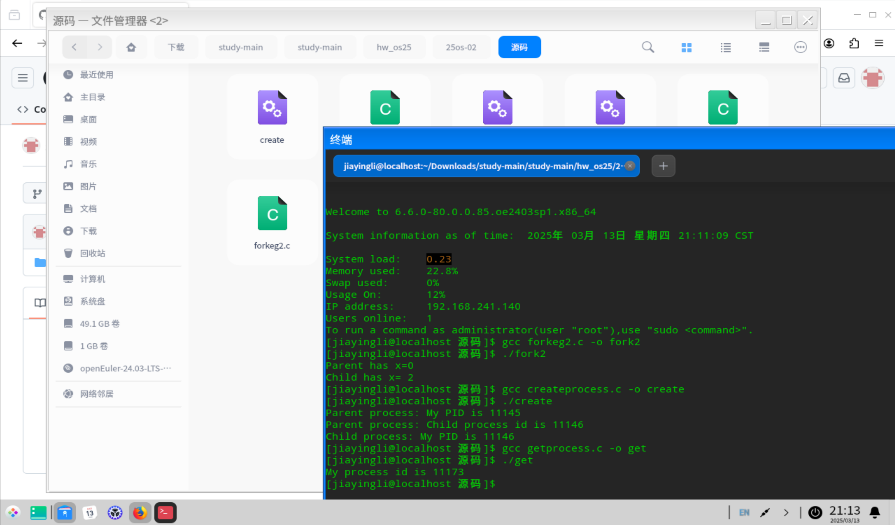
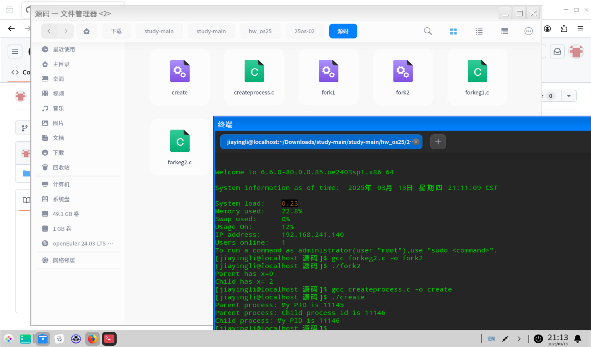
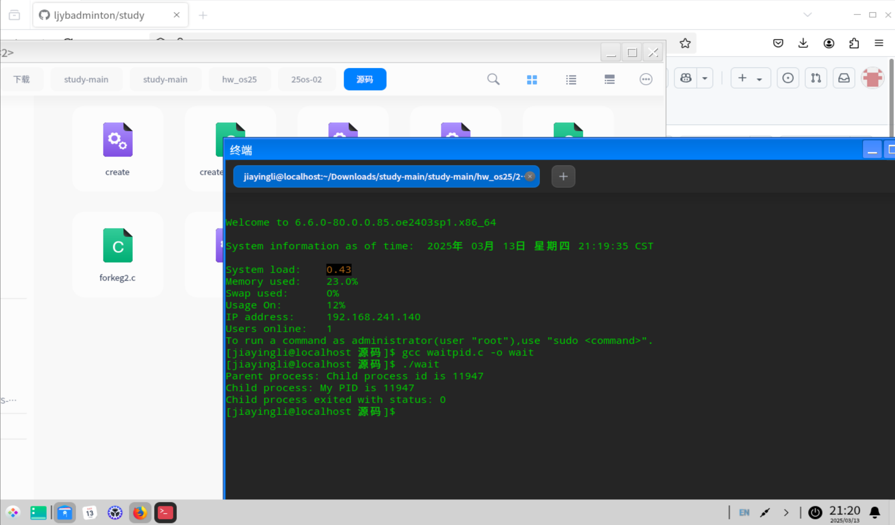
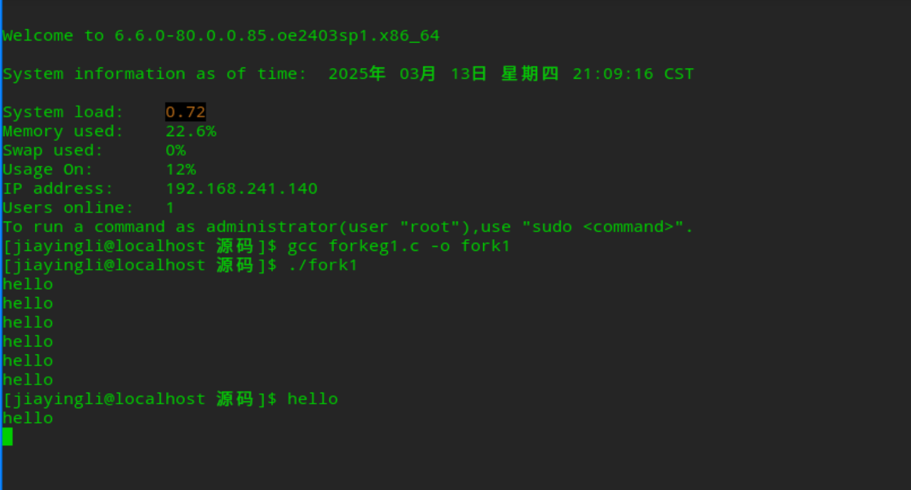
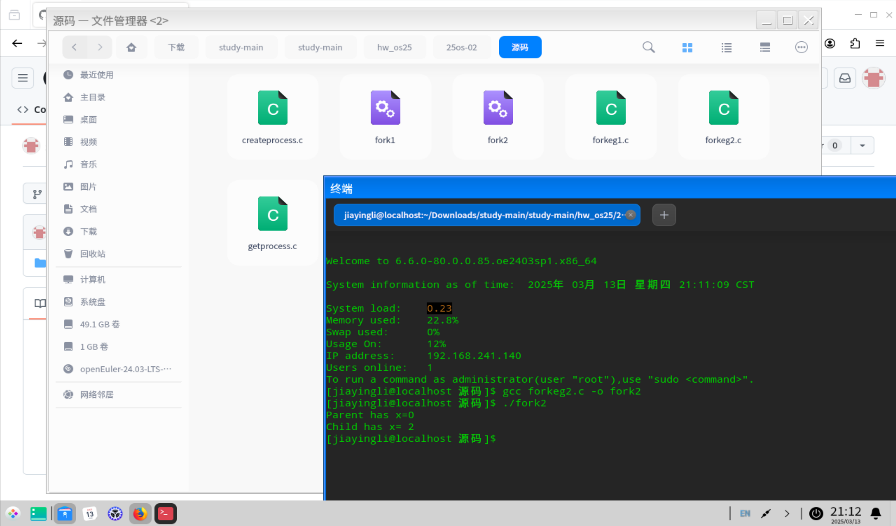

## 在Linux环境的命令行下编辑并编译示例代码  
姓名:李佳盈 学号:20232241142 班级:网络2304

### 一、在命令行下编辑并编译代码的做法
#### 1.在想要创建c文件的文件夹中打开终端
#### 2.输入如下代码
```
#创建c文件
vim name.c
#编译c文件并指定输出对应的可运行文件
gcc 源文件 -o 输出文件名称
#运行c文件
.\输出文件名称
```
## 二、示例实践操作
为方便源代码的编辑，我直接选择了直接在vscode中进行编译
### 1.获取进程的pid
#### (1)示例代码
```
#include<stdio.h>
#include<sys/types.h>
#include<unistd.h>
int main(){
    pid_t my_pid;
    my_pid=getpid();
    printf("My process id is %d\n",my_pid);
    return 0;
}
```
#### (2)实践照片

### 2.使用`fork()`创建进程
#### (1)示例代码
```
#include<stdio.h>
#include<sys/types.h>
#include<unistd.h>
int main(){
    pid_t child_pid;
    child_pid = fork();
    if(child_pid < 0){
        //Fork filed
        perror("Fork failed");
        return 1;
    }else if(child_pid == 0){
        printf("Child process: My PID is %d\n", getpid());
    }
    else{
        printf("Parent process: My PID is %d\n", getpid());
        printf("Parent process: Child process id is %d\n", child_pid);
    }
    return 0;
}
```
#### (2)实践照片

### 3.使用`fork()`创建子进程，并在父进程中等待子进程结束并获取子进程的退出状态
#### (1)示例代码
```
#include <stdio.h>
#include <sys/types.h>
#include <unistd.h>
#include <sys/wait.h>
int main()
{
    pid_t child_pid;
    child_pid = fork();
    if (child_pid < 0)
    {
        // Fork filed
        perror("Fork failed");
        return 1;
    }
    else if (child_pid == 0)
    {
        printf("Child process: My PID is %d\n", getpid());
    }
    else
    {
        // Code executed by parent process
        printf("Parent process: Child process id is %d\n", child_pid);
        // Wait for child process to complete
        int status;
        waitpid(child_pid, &status, 0);
        if (WIFEXITED(status))
        {
            printf("Child process exited with status: %d\n", WEXITSTATUS(status));
        }
    }
    return 0;
}
```
#### (2)实践照片

### 4.多次调用`fork()`创建进程
#### (1)示例代码
```
#include<stdio.h>
#include<sys/types.h>
#include<unistd.h>

int main(){
    fork();
    fork();
    fork();
    printf("hello\n");
    return 0;
}
```
#### (2)实践照片

### 5.`fork()`创建进程并使父进程和子进程共享代码
#### (1)示例代码
```
#include<stdio.h>
#include<sys/types.h>
#include<unistd.h>
#include<stdlib.h>

int main(){
    int x=1;
    pid_t p=fork();
    if(p<0){
        perror("fork fail");
        exit(1);
    }else if(p==0)
        printf("Child has x= %d\n",++x);
    else
        printf("Parent has x=%d\n",--x);
    return 0;
}
```
#### (2)实践照片
