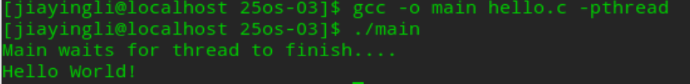
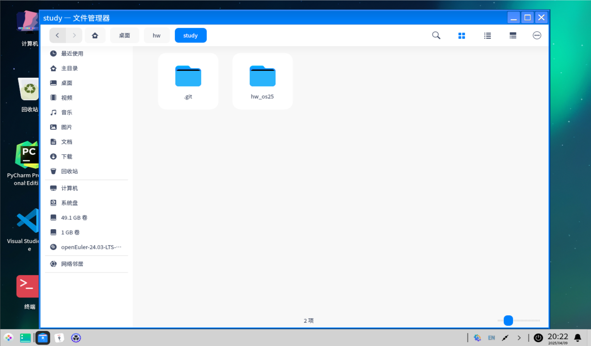

## 在命令行下编辑并编译多线程代码，同时利用git管理往次作业代码

姓名:李佳盈 班级:网络2304 学号:20232241142

### 一、在命令行下编辑并编译多线程代码
1.首先打开终端命令行输入如下代码进入编辑状态```vim hello.c```
2.输入i进入编辑模式后，输入多线程示例代码，按esc键退出编译状态，输入:wq返回命令行
3.输入```gcc -o main hello.c -lpthread```进行编译后，输入```.\main```运行。
运行结果如下:


### 二、利用git管理往次作业代码
1.先在命令行中下载git，并完成相关配置
2.登录gitee创建一个仓库，可以现将仓库内容克隆下来。
3.输入```git pull```,将本地与远程仓库同步。
4.输入```git add .```,将本地更新提交到暂存区
5.输入```git commit -m "注释"```提交到远程
6.输入```git push```将代码上传到gitee上


注:在github上创建仓库需要申请SSH。

gitee仓库连接:<https://gitee.com/jiaying-li050309/study/tree/main>